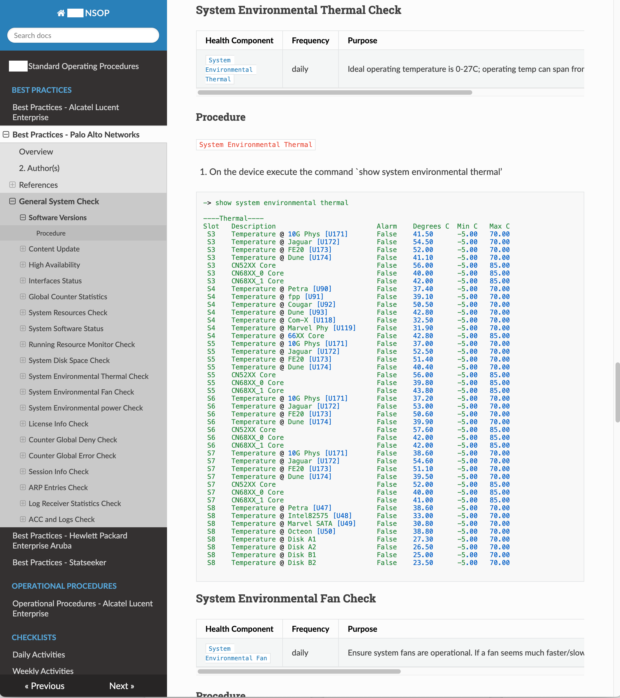
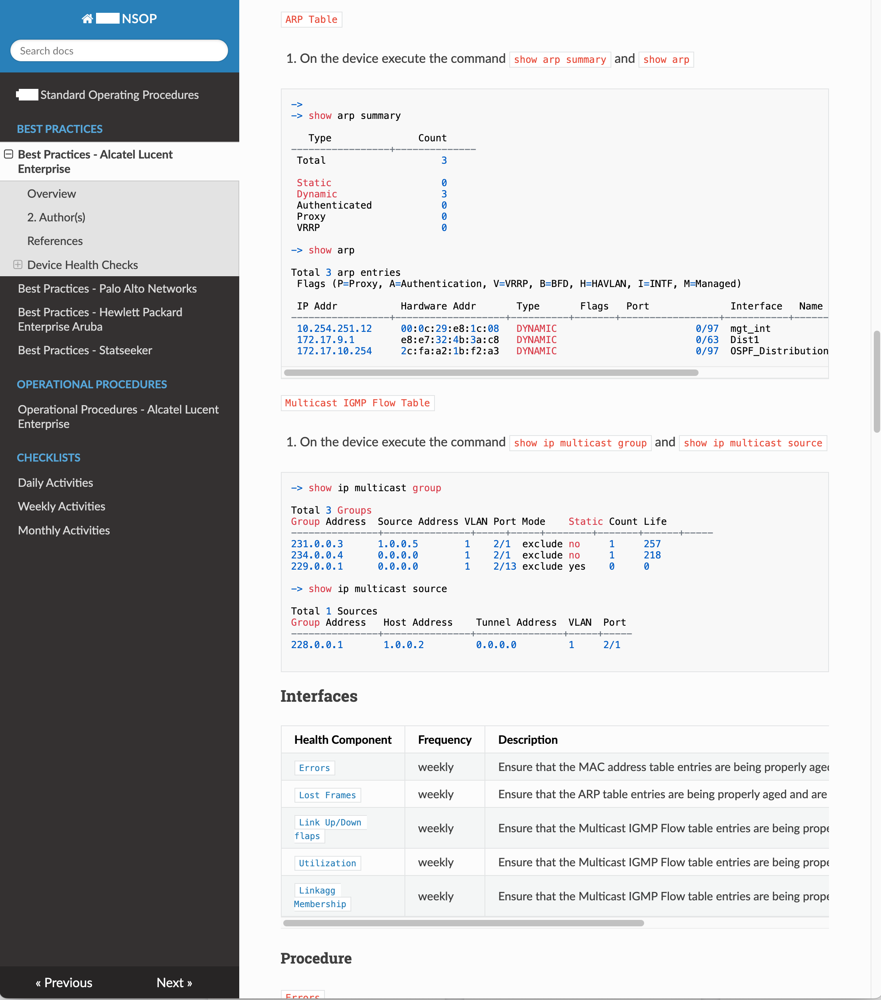

# Network Standard Operating Procedures - Best Practices

## Overview

Jointly Developed a set of Network Standard Operating Procedures best practices for a client's network operations. This encompassed Alcatel Lucent Enterprise (ALE) switches and routers, Palo Alto Network (PAN) firewalls, Hewlett Packard Enterprice (HPE) Aruba Wireless Networks equipment, and Statseeker network monitoring software.

## Exhibited Skills

- Network expertise in switching, routing. security, and wireless networking.
- Documentation and technical writing skills.
- Collaboration and teamwork.
- Coding knowledge of `mkdocs` document generation, and `markdown`.

## Details

Switch Routing Example Page

    

Firewall Security Example Page

    

<!-- Modal Structure -->

    &times;
    

